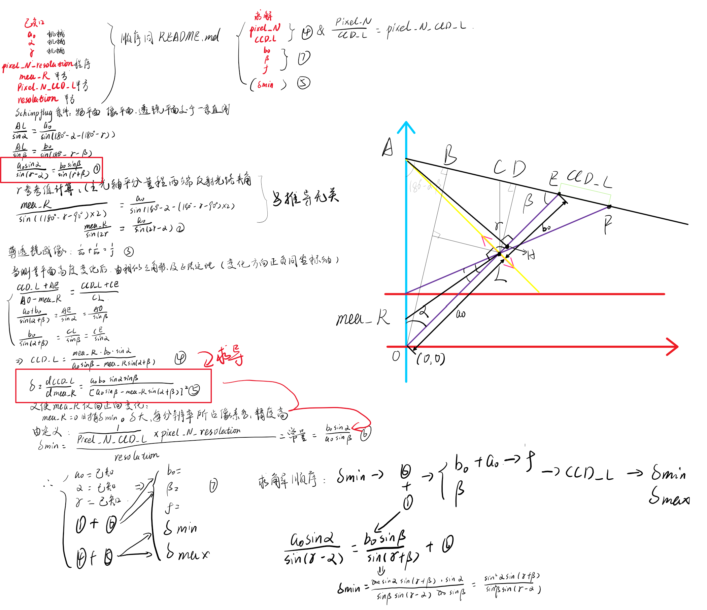

# LTM

此方法通过输入如下参数并根据Scheimpflug条件和薄透镜公式求得如下参数

推导如下：

|         输入参数         |                          备注                           |
| :----------------------: | :-----------------------------------------------------: |
|           a_0            | a_0长度：初始位置激光器在目标物上照射点到透镜中心点长度 |
|          alpha           |     alpha角度：成像透镜光轴与被测表面法线之间的夹角     |
|      tar_mea_range       |                      目标测量范围                       |
| min_pixel_num_resolation |                  最小像素点个数/分辨率                  |
|     pixel_num_CCD_L      |     CCD像素点个数/像CCD有效长度，一般为CCD像素宽度      |
|      tar_resolation      |                     目标测量分辨率                      |

|     输出参数      |                              备注                              |
| :---------------: | :------------------------------------------------------------: |
|     图表 x_y      |                    x为测量高度，y为CCD长度                     |
|   图表 x_theta    |                 x为测量高度，theta为dy/dx比值                  |
|  文字 pixel_num   |                           像素点个数                           |
|    文字 CCD_L     |                          CCD有效长度                           |
|     文字 b_0      | b_0长度：初始位置下，CCD上成像光斑像到成像透镜物方主平面的距离 |
|     文字 beta     |            beta角度：成像透镜光轴与CCD光敏面的夹角             |
| 文字 focal_length |                          成像透镜焦距                          |

